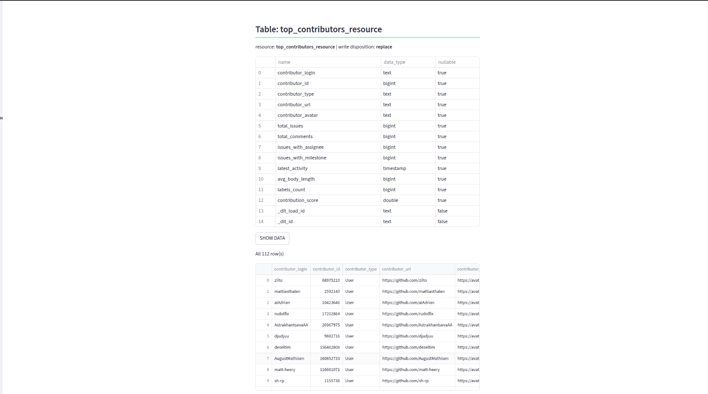
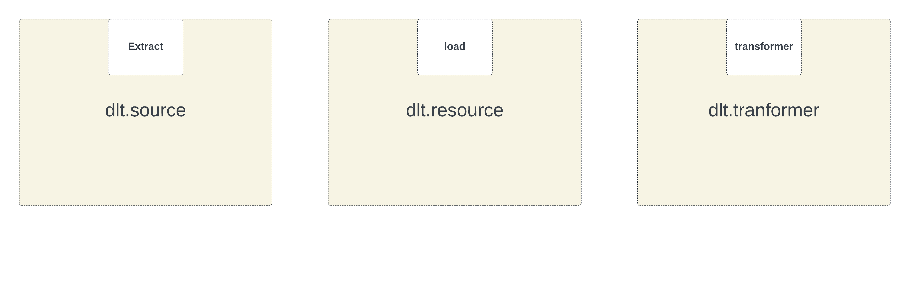

# GitHub Issues Pipeline with dlt

## What is dlt?

dlt is a minimal, pip-installable Python library for building data pipelines. Similar to how Pandas or NumPy made machine learning accessible to millions, dlt brings the same simplicity and power to data engineering.

## Use Case: GitHub Issues Pipeline

This project demonstrates how to use dlt to build a pipeline that:

- Fetches open issues from a GitHub repository. 
- Transforms and filters them (only real issues, not pull requests).
- Analyzes contributors and calculates simple contribution stats.

## Output Overview

- A table of top contributors ranked by their contribution score.
- Basic statistics such as the number of issues, comments, labels, milestones, and last activity.
- A DuckDB file created locally that stores the processed data.

## Setup & Run

``` bash
# 1. Create environment with Conda
conda create -n dlt_env python=3.10 -y
conda activate dlt_env

# 2. Install dlt
pip install dlt
pip install -r requirements.txt

# 3. Run the pipeline
python3 github_api_pipeline.py 
# OR
python github_api_pipeline.py

# 4. Inspect the pipeline results
dlt pipeline github_issues_pipeline show

# 5. A DuckDB file will be created in the current working directory

# 6. A Streamlit application will open and display contributions
```

## Demo Screenshots





## Key Concepts (in simple words)

-   **source**: Defines where you fetch the data from (e.g., GitHub API).
-   **resource**: Handles the actual fetching, pagination, and related logic.
-   **transformer**: A decorator-based function that transforms the data into the desired structure.

## Notes

In this project, DuckDB is used as the destination and GitHub as the source. However, many other sources and destinations are supported by dlt. Refer to the official documentation for more details, they are well-written and very helpful.


# Design Decisions

## Why this API?
GitHub is free, widely used, and familiar to most developers. It provides rich data on issues, comments, labels, and contributors. Also, there’s plenty of material and examples in the **dlt official docs**, which makes learning and extending this pipeline easier.

## How I chosed incremental fields
I used `created_at` and `updated_at` to fetch only new or updated issues since the last run. This makes the pipeline efficient and prevents duplicates.

## What we’d do next with more time
I’d spend more time learning the dlt architecture and understanding the design principles behind it. Then I’d explore use cases that showcase the full power of dlt, aiming to build a project that demonstrates its efficiency, flexibility, and ability to handle complex data pipelines in a simple and elegant way. This could include fetching more GitHub data pull requests, commits, releases, and adding more resources, either from GitHub (like contributors, issues with labels, milestones, repository statistics) or from other sources. Ultimately, I’d build an interactive app that provides deep insights and demonstrates the versatility of dlt.

# Testing Strategy

## Unit Test
Tests the `filter_valid_issues()` function in isolation to verify it correctly filters GitHub issues, rejecting pull requests, closed issues, and issues with invalid user data while accepting valid open issues.

## Integration Test
Tests the complete dlt pipeline end-to-end, validating the full data flow from API pagination through data transformation to final output, ensuring all business rules and data integrity are maintained.

## Run Tests
```bash
# Run unit tests
python3 -m pytest unit_test.py -v

OR 
python -m pytest unit_test.py -v


# Run integration tests
python3 -m pytest integration_test.py -v

OR 
python -m pytest integration_test.py -v
